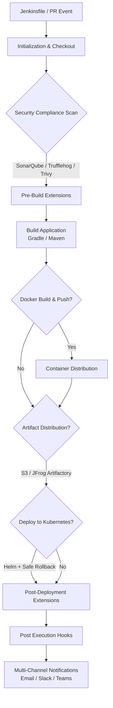

# Nexus Shared Pipeline Library

A centralized Jenkins Shared Library designed to standardize, secure, and accelerate the CI/CD lifecycle across company microservices. It encapsulates complex declarative workflows into a clean, unified pipeline wrapper.

---

## Architecture & Pipeline Flow



---

## Quick Start

To utilize this shared library in your project, reference it at the top of your Jenkinsfile and invoke the nexusPipeline wrapper:

```groovy
@Library('nexus-shared-lib@v1.0.0') _

nexusPipeline([
    projectName: 'my-microservice',
    environment: 'production',
    buildTool: 'gradle',

    // Code Quality & Security
    runSecurityScan: true,
    runAdvancedSecurityGuard: true,

    // Containerization
    buildAndPushDocker: true,
    dockerRegistry: 'registry.company.io',
    dockerImageName: 'nexus/my-microservice',
    dockerCredentialsId: 'docker-registry-credentials',

    // Artifact Distribution
    uploadToArtifactory: true,
    artifactoryTargetRepo: 'libs-release-local',

    // Kubernetes / Helm Deployment
    deployToK8s: true,
    helmReleaseName: 'my-microservice',
    helmChartPath: './charts/my-microservice',
    helmNamespace: 'production',

    // Multi-Channel Notifications
    notificationEmail: 'devops-alerts@company.com',
    slackChannel: '#deployments',
    teamsWebhookUrl: '[https://outlook.office.com/webhook/](https://outlook.office.com/webhook/)...'
])
```

---

## Documentation Structure

For deep-dive configurations, advanced setups, and internal guidelines, please refer to the `docs/` directory:

* [Jenkins Setup Guide](docs/jenkins-setup.md) - Prerequisites and global library configuration in Jenkins.
* [Vars Guide](docs/vars-guide.md) - Comprehensive overview of available global utility functions.
* [Adding New Vars](docs/contributing-vars.md) — Standard template and best practices for creating new global pipeline functions.
* [Configuration Parameters](docs/parameters.md) — Complete list of options available in PipelineConfig.
* [Custom Extension Hooks](docs/custom-hooks.md) — Injecting custom closures (beforeBuild, afterBuild, etc.).
* [Security & Compliance Guard](docs/security.md) — Overview of Trufflehog secret leaks and Trivy vulnerability enforcement.

---

## Usage Examples

Check the `examples/` directory for ready-to-use boilerplate code:

* [Basic Pipeline](example/basic-pipeline.groovy) — Minimal setup for quick builds.
* [Complex Pipeline](example/complex-pipeline.groovy) — Full configuration with security, containerization, and K8s deployment.
